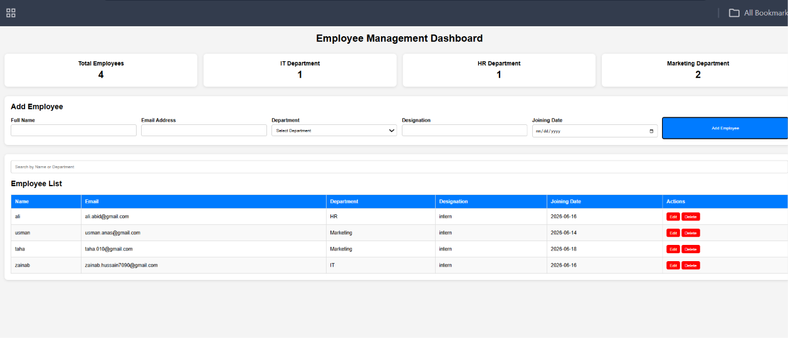
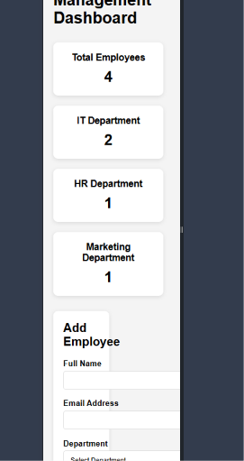

# Employee Management Dashboard

## Project Overview

Employee Management Dashboard is a web application built using HTML, CSS, and JavaScript. It allows users to manage employee records without using any backend or database. All data is stored in Local Storage.

## Features Implemented

* Employee Registration Form
* Form Validation
* Employee Listing Table
* Edit Employee
* Delete Employee
* Search Employees by Name
* Search Employees by Department
* Dashboard Statistics
* Local Storage Integration
* Responsive Design

## Technologies Used

* HTML
* CSS
* JavaScript
* Local Storage

## Instructions to Run

1. Download or clone the repository.
2. Open the project folder in VS Code.
3. Open `index.html`.
4. Run the project using Live Server.

## Folder Structure

employee-dashboard/
├── index.html
├── style.css
├── script.js
└── README.md

## Screenshots

### Desktop View

(Add screenshot here)

### Mobile View

(Add screenshot here)
## Screenshots

### Desktop View

### Mobile View

